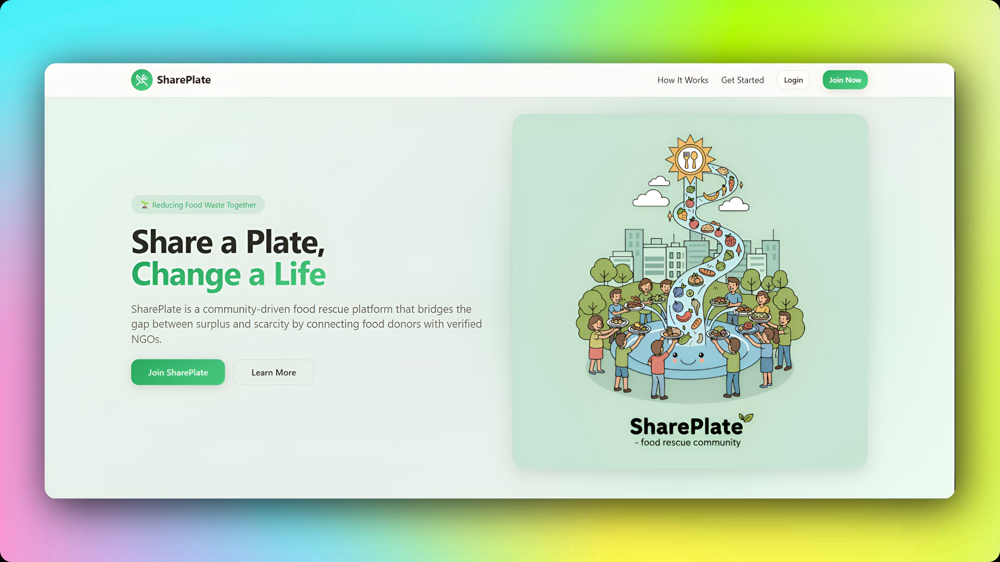
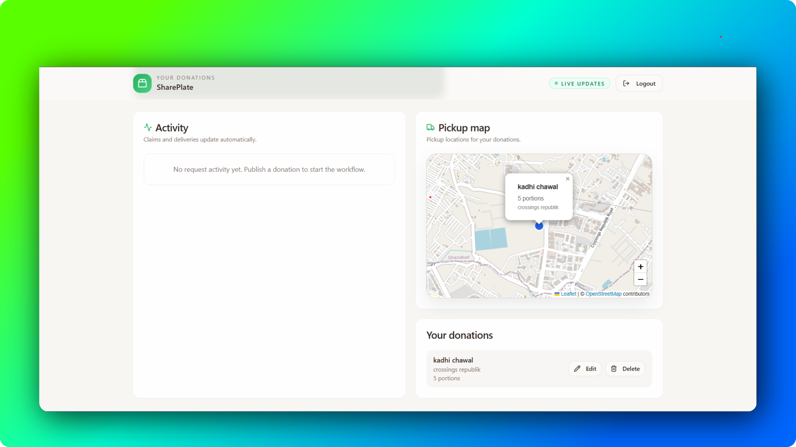
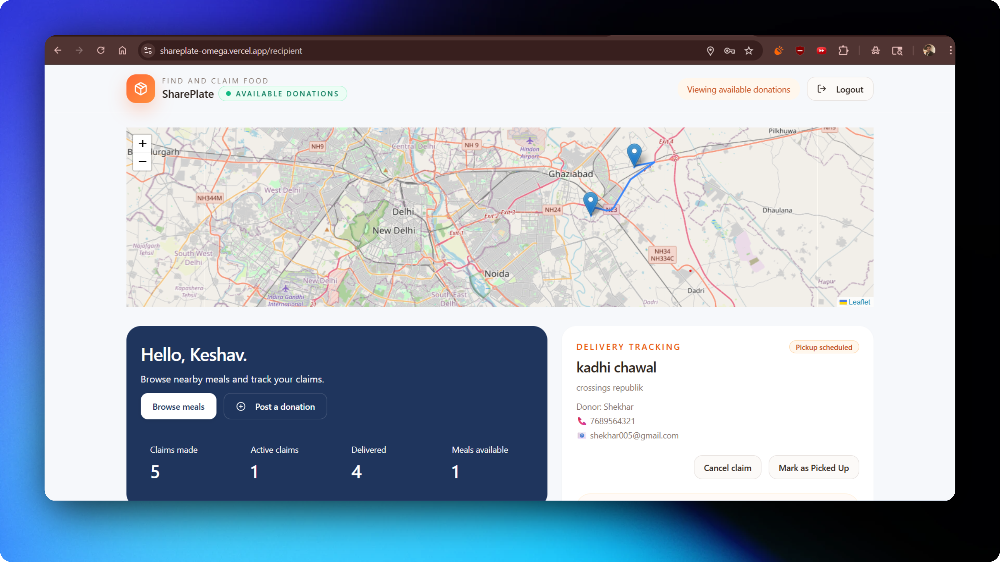

# SharePlate

SharePlate is a full-stack food donation platform that connects food donors with recipients to reduce food waste and improve access to surplus food within local communities.

---

## About

SharePlate enables individuals, restaurants, organizations, and community groups to donate surplus food while allowing verified recipients to discover, claim, and coordinate pickups through a unified platform.

The application focuses on simplifying the donation process, improving transparency, and making food redistribution more efficient through real-time updates, route visualization, and role-based access.

---

## Features

- Food donation management
- Real-time donation claiming
- Donor and recipient dashboards
- Role-based authentication
- Admin verification system
- Interactive maps using OpenStreetMap
- Route generation using OSRM
- Dashboard analytics
- Responsive interface

---

## Application Preview

### Landing Page



### Donor Dashboard



### Recipient Dashboard



---

## Platform Workflow

```text
Donor
   │
   ▼
Creates a food donation
   │
   ▼
Donation becomes available
   │
   ▼
Recipient discovers nearby donation
   │
   ▼
Recipient claims donation
   │
   ▼
Route generated using OSRM
   │
   ▼
Pickup coordinated
   │
   ▼
Donation completed
```

---

## Tech Stack

### Frontend

- React
- TypeScript
- Vite
- React Router
- TanStack Query
- Tailwind CSS
- shadcn/ui

### Backend

- Python
- Django
- Django REST Framework
- PostgreSQL (Neon)

### Maps & Routing

- Leaflet
- OpenStreetMap
- OSRM

### Services

- Resend
- Nominatim

---

## Project Structure

```text
client/
├── components/
├── pages/
├── hooks/
├── services/
├── assets/

server/
├── routes/
├── controllers/
├── middleware/
├── models/
└── utils/
```

---

## License

Copyright © 2026 Yash Kaushik.

All Rights Reserved.

This repository is publicly available for viewing and evaluation purposes only. No permission is granted to copy, modify, distribute, sublicense, or use any part of this source code without prior written permission from the copyright holder.
